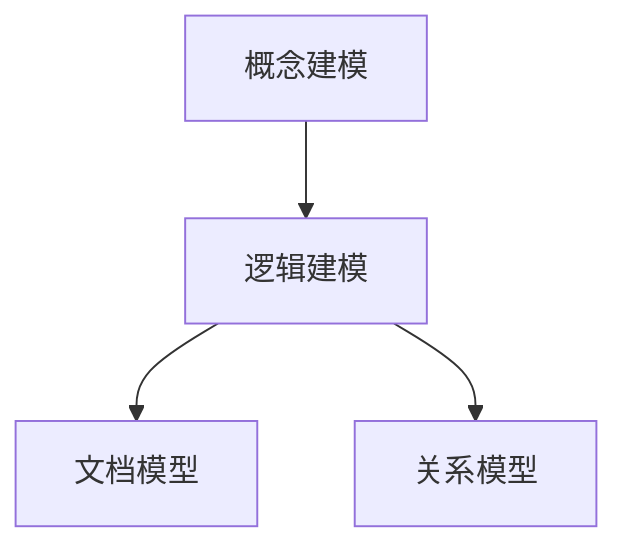
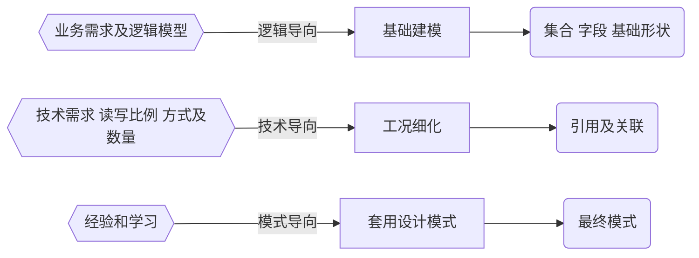

[toc]


[[toc]]
# chap01
## 08 aggregate
常见步骤

| 步骤 | 作用 | SQL等价运算符
| --- | --- | ---
| $match | 过滤 | WHERE
| $project | 投影 | AS
| $sort | 排序 | order by
| $group | 分组 | group by
| $skip/$limit | 结果限制 | SKIP/LIMIT
| $lookup | 左外连接 | Left out join
| --- | --- | ---
| $unwind | 展开数组 | n/a
| $graphLookup| 图搜索 | n/a
| $facet/$bucket | 分面搜索 | n/a


聚合查询可以用于OLAP和OLTP的场景

| OLTP | OLAP
| --- | ---
| 计算  | - 分析一段时间内的销售总额、均值
|   | - 分析一段时间内的销售总额、均值
|   | - 计算一段时间内的净利润
|   | - 分析购买人的年龄分布
|   | - 分析学生成绩分布
|   | - 统计员工绩效

# chap02
## 2-1 模型设计基础

|   | 概念模型 CDM |  逻辑模型 LDM |  物理模型 PDM
| --- | --- | --- | ---
| 目的|  描述业务系统要管理的对象 | 基于概念模型，详细列出所有实体、实体的属性及关系 |  根据逻辑模型，结合数据库的物理结构，设计具体的表结构，字段列表及主外键
| 特点 | 用概念名词来描述现实中的实体及业务规则，如“联系人” | 基于业务的描述和数据库无关 |  技术实现细节和具体的数据库类型相关 
| 主要使用者  | 用户 需求分析师 | 需求分析师 架构师及开发者 | 开发者 DBA

数据模型的三要素： 实体、属性、关系 
数据模型的三层深度： 概念模型，逻辑模型，物理模型

## 2-2 JSON 文档模型设计特点

文档模型的设计原则：性能和易用


### 关系模型 vs 文档模型

|     | 关系数据库  | JSON 文档模型
| --- | --- | ---
| 模型设计层次|  概念模型 逻辑模型 物理模型 | 概念模型 逻辑模型
| 模型实体 | 表 | 集合
| 模型属性 | 列 | 字段
| 模型关系 | 关联关系，主外键 | 内嵌数组，引用字段


## 2-3 文档模型设计之一 基础设计
```mermai   d
graph LR
    A{{业务需求<br />及<br />逻辑模型}} -->|逻辑导向| B[基础建模]
    B --> C(集合<br />字段<br />基础形状)

    A2{{技术需求<br />读写比例<br />方式及数量}} -->|技术导向| B2[工况细化]
    B2 --> C2(引用及关联)

    A3{{经验和学习}} -->|模式导向| B3[套用设计模式]
    B3 --> C3(最终模式)

```

第一步：建立基础文档模型
1. 根据概念模型或者业务需求推导出逻辑模型 – 找到对象
2. 列出实体之间的关系（及基数） - 明确关系
3. 套用逻辑设计原则来决定内嵌方式 – 进行建模
4. 完成基础模型构建
#### 1-1 关系建模
基本原则:
一对一关系以内嵌为主 作为子文档形式 或者直接在顶级 不涉及到数据冗余
例外情况:
如果内嵌后导致文档大小超过16MB 
#### 1-N 关系建模
基本原则:
一对多关系同样以内嵌为主 用数组来表示一对多 不涉及到数据冗余
例外情况:
内嵌后导致文档大小超过16MB 数组长度太大（数万或更多） 数组长度不确定
#### N-N 关系建模 内嵌数组模式
基本原则:
不需要映射表 一般用内嵌数组来表示一对多 通过冗余来实现N-N
例外情况:
内嵌后导致文档大小超过16MB 数组长度太大（数万或更多） 数组长度不确定
#### 基础建模小结
90:10 规则： 大部分时候你会使用内嵌来表示 1-1，1-N，N-N
内嵌类似于预先聚合（关联）
内嵌后对读操作通常有优势（减少关联）

## 2-4 文档模型设计之二 工况细化

> MongoDB 引用设计的限制
- MongoDB 对使用引用的集合之间并无主外键检查
- MongoDB 使用聚合框架的 $lookup 来模仿关联查询
- $lookup 只支持 left outer join
- $lookup 的关联目标（from）不能是分片表

## 2-5 文档模型设计之三 模式套用

## 2-6 设计模式集锦

| 模式名 | 场景 | 痛点  | 设计模式方案及优点
| --- | --- | --- | --- 
| 列转行 | 产品属性 ‘color’, ‘size’, ‘dimensions’, ...  or 多语言（多国家）属性 | 文档中有很多类似的字段 会用于组合查询搜索，需要见 很多索引 | 转化为数组，一个索引解决所 有查询问题
| 版本字段 | 任何有版本衍变的数据库 | 文档模型格式多，无法知道其 合理性 升级时候需要更新太多文档 | 增加一个版本号字段 快速过滤掉不需要升级的文档 升级时候对不同版本的文档做 不同的处理
| 近似计算 | 网页计数 各种结果不需要准确的排名 | 写入太频繁，消耗系统资源 |  间隔写入，每隔10次或者100次  大量减少写入需求
| 预聚合 | 准确排名 排行榜 | 统计计算耗时，计算时间长 模型中直接增加统计字段 | 每次更新数据时候同时更新统计值

## 2-7 事务开发 写操作事务
writeConcern 决定一个写操作落到多少个节点上才算成功。writeConcern 的取值包括：
• 0：发起写操作，不关心是否成功；
• 1~集群最大数据节点数：写操作需要被复制到指定节点数才算成功；
• majority：写操作需要被复制到大多数节点上才算成功。
发起写操作的程序将阻塞到写操作到达指定的节点数为止

## 2-8 事务开发 读操作事务之一
在读取数据的过程中我们需要关注以下两个问题：
• 从哪里读？
• 什么样的数据可以读？
第一个问题是是由 readPreference 来解决
第二个问题则是由 readConcern 来解决

## 2-10 事务开发 多文档事务


| 事务属性 | 支持程度
| --- | ---
| Atomocity 原子性 | 单表单文档 ： 1.x 就支持 复制集多表多行：4.0 复制集 分片集群多表多行4.2
| Consistency 一致性 | writeConcern, readConcern (3.2)
| Isolation 隔离性|  readConcern (3.2)
| Durability 持久性 | Journal and Replication

> MongoDB 的事务错误处理机制不同于关系数据库：
- 当一个事务开始后，如果事务要修改的文档在事务外部被修改过，则事务修改这个
文档时会触发 Abort 错误，因为此时的修改冲突了；
- 这种情况下，只需要简单地重做事务就可以了；
- 如果一个事务已经开始修改一个文档，在事务以外尝试修改同一个文档，则事务以
外的修改会等待事务完成才能继续进行（write-wait.md实验）。

## 2-11 Change Stream

|  | Change Stream  | 触发器
| --- | --- | ---
|触发方式 | 异步 | 同步（事务保证）
| 触发位置 | 应用回调事件 | 数据库触发器
| 触发次数 | 每个订阅事件的客户端 | 1次（触发器）
| 故障恢复 | 从上次断点重新触发 | 事务回滚

## 2-12 MongoDB 开发最佳实践

# chap04
## 4-1 MongoDB 应用场景及选型
> MongoDB 数据库定位
 OLTP 数据库
- 原则上 Oracle 和 MySQL 能做的事情，MongoDB 都能做（包括 ACID 事务）
- 优点：横向扩展能力，数据量或并发量增加时候架构可以自动扩展
- 优点：灵活模型，适合迭代开发，数据模型多变场景
- 优点：JSON 数据结构，适合微服务/REST API

| 功能 | MongoDB  | 关系型数据库
| --- | --- | ---
| 亿级以上数据量 |  轻松支持|  要努力一下，分库分表
| 灵活表结构 | 轻松支持 | Entity Key /Value 表，关联 查询比较痛苦
|  高并发读 | 轻松支持 | 需要优化
| 高并发写 | 轻松支持 | 需要优化
| 跨地区集群 | 轻松支持 | 需要定制方案
| 分片集群 | 轻松支持 | 需要中间件
| 地理位置查询 | 比较完整的地理位置 | PG 还可以，其他数据库略麻 烦
| 聚合计算 | 功能很强大 | 使用 Group By 等，能力有限
| 异构数据 | 轻松支持 | 使用 EKV 属性表
| 大宽表 | 轻松支持 | 性能受限

## 4.7 MongoDB + Spark

|    | HDFS | MongoDB
| --- | --- | ---
| 共同点 | 横向扩展，支持 TB-PB 级数据量
|  | 低成本， x86
|  | 数据自动多份复制
|  | 支持非结构化数据
| 差异点 | 粗颗粒度存储 | 细颗粒度，结构化存储
|   | 无索引 |支持使用索引，更加快速
|   | 一次写入，多次读 | 读写混合
|   | 非交互式，离线 分钟级 SLA | 交互式，实时在线 毫秒级 SLA

[repo](https://github.com/mongodb/mongo-spark)

## 4-9 MongoDB SQL 套接件


# ref 
## 迁移时应用往往已经上线相当长一段时间，如何迁移这些数据到 MongoDB？
- 数据库导出+导入
- 批量迁移工具
- 实时同步工具
- 应用主导迁移

数据迁移方式比较

| 方法 | 技术实现方式 | 特点 | 适用场景
| --- | --- | --- | ---
| 数据库导出导入 | 数据库自带工具 自己编写简单脚本 | 简单方便 一次型迁移全量数据 | 基于已有数据的新应用 旧应用更新换代，采用重写方式
| 批量同步 | Talend Pentaho 或使用脚本程序 | 适用 SQL，批量查询出需要数据， 写到目标端 无需代码开发
| 实时同步 | Informatica Oracle Golden Gate Tapdata | 基于数据库日志解析并实时写入到 目标端 准实时同步 无需代码开发 | 无缝切换 老应用不下线，和新应用并存 主机下行 关系库加速 实时数据平台
| 应用迁移 | 在已有应用中增加对 MongoDB 的支持 | 需要较多的开发和测试支持 | 旧应用更新换代，采用修改升级原有应用方式

## 数据时代

|1995 Information Technology |2015 Data Technology Era
|--- | ---
| ERP CRM OMS WMS CMS BPM | 客户洞察 个性化 推荐 数据大屏 数据分析
| 主要场景： 信息化建设  | 主要场景： 数字化驱动 数字化转型
